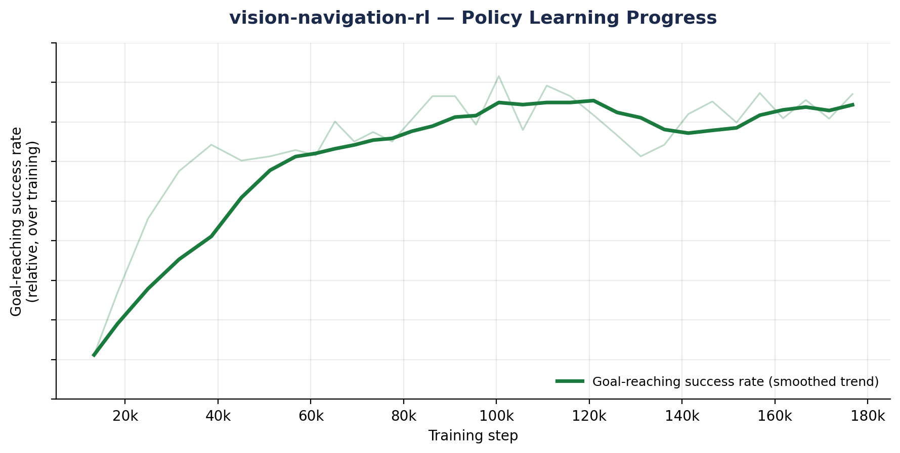

# vision-navigation-rl

Vision-based obstacle avoidance and goal navigation for a quadcopter, trained with reinforcement learning in [NVIDIA Isaac Lab](https://isaac-sim.github.io/IsaacLab/).

A Crazyflie drone learns to fly from a random start point to a random goal, through a field of randomly placed obstacles, using **only its onboard RGB and depth cameras** — no privileged map, no global obstacle positions fed to the policy.

> Training is ongoing — the training progress below reflects a checkpoint after ~52k episodes. This README will be updated as later runs improve on it.

---

## Why this project

Most "RL for navigation" demos give the agent perfect knowledge of obstacle positions. That's not how a real drone perceives the world. This project constrains the agent to the same information a physical UAV would actually have — a forward-facing camera stream — and asks it to learn collision-free navigation from that alone. The gap between "flies well with a perfect map" and "flies well from pixels" is most of the actual engineering problem, and it's what this project is built around.

## How it works

**Environment:** a Crazyflie quadcopter spawns in a 20×20 m simulated arena alongside 10 randomly placed cylindrical obstacles, with a goal sampled 3.5–5 m away at a random heading. Obstacle and goal positions are re-randomized every episode, with minimum-spacing constraints so the task can't be memorized. Built on Isaac Lab's `DirectRLEnv`, running **64 parallel environments** on GPU for sample-efficient training.

**Perception:** each drone carries a forward-facing camera producing 64×64 RGB and depth frames, stacked over the last 3 timesteps to give the policy short-term temporal context (e.g. whether an obstacle is getting closer).

**Policy network:** a dual-branch CNN encodes the RGB and depth streams separately, concatenates their features across all 3 stacked frames, fuses that with an 8-dimensional state vector (goal-relative position, heading, velocity), and feeds a shared actor-critic backbone. Trained with **PPO** (via [`skrl`](https://skrl.readthedocs.io/)) — a stochastic Gaussian policy head and a value head share the same visual backbone.

**Control architecture — RL for decisions, PID for execution:** the policy doesn't directly output motor commands. It outputs two high-level values — desired forward speed and desired yaw rate. Those pass through a cascaded PID control stack (altitude → forward-velocity → attitude) that converts them into physically realistic thrust and torque on the simulated airframe. This keeps the learning problem focused on *navigation decisions* while leaving low-level flight stabilization to classical control, which is both more sample-efficient to train and more realistic as a path toward transferring to real hardware.

**Reward shaping:** the reward signal combines several terms, tuned to encourage efficient, safe flight rather than just eventually reaching the goal:

| Term | Purpose |
|---|---|
| Progress reward | Reward for reducing distance to goal each step |
| Success reward | Sparse bonus for reaching the goal within threshold |
| Collision penalty | Penalizes contact force against obstacles, measured via filtered contact sensors on the airframe |
| Heading error penalty | Encourages the drone to face its direction of travel |
| Yaw-change penalty | Discourages erratic, high-frequency turning |
| Altitude penalty | Keeps the drone near a stable target altitude |
| Angular velocity penalty | Discourages unstable spinning |

Episodes terminate early on obstacle collision, excessive altitude, or flying too far from the arena center, in addition to the normal timeout.

## Tech stack

`Python` · `PyTorch` · `NVIDIA Isaac Lab` · `Isaac Sim` · `skrl` (PPO) · `Gymnasium` · trained on a cloud GPU instance

## Project structure

```
drone/
├── drone_env.py        # environment logic: physics step, PID control cascade,
│                        # reward computation, resets, obstacle/goal randomization
├── drone_env_cfg.py     # environment config: scene, sensors, robot, reward
│                        # coefficients, simulation parameters
├── learning/
│   └── skrl/
│       ├── models.py     # dual-CNN + fusion actor-critic policy network
│       └── agent.py      # PPO agent configuration
└── scripts/
    └── train.py          # training entry point
```

## Running it

Requires an Isaac Lab installation (GPU required; developed and trained on a cloud GPU instance).

```bash
python drone/scripts/train.py
```

This registers the `Drone-Nav-Direct-v0` Gymnasium environment, launches 64 parallel simulated drones, and trains for 200,000 timesteps with PPO. Pass `--video` to periodically record rollout clips during training.

Training logs episode-level success rate and collision rate to `training_stats.csv` for tracking learning progress over time.

## Training Progress

This run was trained to 52,237 episodes on a rented cloud GPU, then deliberately stopped short of full convergence — continuing to train against a plateaued collision-rate curve has a real dollar cost per additional hour, and the more useful next step is a reward-shaping change (below), not more compute against the current setup.



The goal-reaching success rate trends clearly upward over the course of training, showing the policy is learning the navigation task from vision alone rather than plateauing immediately. Collision avoidance, by contrast, improved early on but plateaued well before success rate did — the clearest signal that the current reward balance under-weights collisions relative to goal-reaching, and that more training steps on this exact configuration wouldn't have fixed it. The next iteration increases the relative weight of the collision penalty rather than the training budget (see below).

## What's next

- [x] Log and chart success-rate / collision-rate curves over training
- [ ] Increase the relative weight of the collision penalty — the diagnosed fix, to be tested before spending further GPU budget on this configuration
- [ ] Record and add a rollout demo clip (`train.py` already supports `--video`)
- [ ] Evaluate generalization to obstacle counts/densities not seen during training
- [ ] Explore sim-to-real transfer considerations

## Author

Built by [BlueRain04](https://github.com/BlueRain04) — part of an ongoing portfolio of applied reinforcement learning and computer vision projects, alongside a multi-agent RL traffic signal control system.# vision-navigation-rl

Vision-based obstacle avoidance and goal navigation for a quadcopter, trained with reinforcement learning in [NVIDIA Isaac Lab](https://isaac-sim.github.io/IsaacLab/).

A Crazyflie drone learns to fly from a random start point to a random goal, through a field of randomly placed obstacles, using **only its onboard RGB and depth cameras** — no privileged map, no global obstacle positions fed to the policy.

> Training is ongoing — the results below reflect progress after ~52k episodes / ~181k environment steps. This README will be updated as later checkpoints improve.

---

## Why this project

Most "RL for navigation" demos give the agent perfect knowledge of obstacle positions. That's not how a real drone perceives the world. This project constrains the agent to the same information a physical UAV would actually have — a forward-facing camera stream — and asks it to learn collision-free navigation from that alone. The gap between "flies well with a perfect map" and "flies well from pixels" is most of the actual engineering problem, and it's what this project is built around.

## How it works

**Environment:** a Crazyflie quadcopter spawns in a 20×20 m simulated arena alongside 10 randomly placed cylindrical obstacles, with a goal sampled 3.5–5 m away at a random heading. Obstacle and goal positions are re-randomized every episode, with minimum-spacing constraints so the task can't be memorized. Built on Isaac Lab's `DirectRLEnv`, running **64 parallel environments** on GPU for sample-efficient training.

**Perception:** each drone carries a forward-facing camera producing 64×64 RGB and depth frames, stacked over the last 3 timesteps to give the policy short-term temporal context (e.g. whether an obstacle is getting closer).

**Policy network:** a dual-branch CNN encodes the RGB and depth streams separately, concatenates their features across all 3 stacked frames, fuses that with an 8-dimensional state vector (goal-relative position, heading, velocity), and feeds a shared actor-critic backbone. Trained with **PPO** (via [`skrl`](https://skrl.readthedocs.io/)) — a stochastic Gaussian policy head and a value head share the same visual backbone.

**Control architecture — RL for decisions, PID for execution:** the policy doesn't directly output motor commands. It outputs two high-level values — desired forward speed and desired yaw rate. Those pass through a cascaded PID control stack (altitude → forward-velocity → attitude) that converts them into physically realistic thrust and torque on the simulated airframe. This keeps the learning problem focused on *navigation decisions* while leaving low-level flight stabilization to classical control, which is both more sample-efficient to train and more realistic as a path toward transferring to real hardware.

**Reward shaping:** the reward signal combines several terms, tuned to encourage efficient, safe flight rather than just eventually reaching the goal:

| Term | Purpose |
|---|---|
| Progress reward | Reward for reducing distance to goal each step |
| Success reward | Sparse bonus for reaching the goal within threshold |
| Collision penalty | Penalizes contact force against obstacles, measured via filtered contact sensors on the airframe |
| Heading error penalty | Encourages the drone to face its direction of travel |
| Yaw-change penalty | Discourages erratic, high-frequency turning |
| Altitude penalty | Keeps the drone near a stable target altitude |
| Angular velocity penalty | Discourages unstable spinning |

Episodes terminate early on obstacle collision, excessive altitude, or flying too far from the arena center, in addition to the normal timeout.

## Tech stack

`Python` · `PyTorch` · `NVIDIA Isaac Lab` · `Isaac Sim` · `skrl` (PPO) · `Gymnasium` · trained on a cloud GPU instance

## Project structure

```
drone/
├── drone_env.py        # environment logic: physics step, PID control cascade,
│                        # reward computation, resets, obstacle/goal randomization
├── drone_env_cfg.py     # environment config: scene, sensors, robot, reward
│                        # coefficients, simulation parameters
├── learning/
│   └── skrl/
│       ├── models.py     # dual-CNN + fusion actor-critic policy network
│       └── agent.py      # PPO agent configuration
└── scripts/
    └── train.py          # training entry point
```

## Running it

Requires an Isaac Lab installation (GPU required; developed and trained on a cloud GPU instance).

```bash
python drone/scripts/train.py
```

This registers the `Drone-Nav-Direct-v0` Gymnasium environment, launches 64 parallel simulated drones, and trains for 200,000 timesteps with PPO. Pass `--video` to periodically record rollout clips during training.

Training logs episode-level success rate and collision rate to `training_stats.csv` for tracking learning progress over time.

## Results

This run was trained to **52,237 episodes / ~181k of a planned 200k environment steps** on a rented cloud GPU, then deliberately stopped short of full convergence — continuing to train against a flat collision-rate curve has a real dollar cost per additional hour, and the more useful next step is a reward-shaping change (below), not just more compute against the current setup.


Over this budget, the **success rate nearly doubled** from its early-training level to a recent-window peak of ~36%, showing the policy is clearly learning the navigation task from vision alone. The **collision rate plateaued around 24%** and did not meaningfully improve with additional training — which is the actual signal that matters here: more steps on this configuration weren't the fix, so continuing to spend GPU hours on it wouldn't have been a good trade. The next iteration increases the relative weight of the collision penalty rather than the training budget (see below).

| Metric | Value |
|---|---|
| Cumulative success rate (full run) | 31.0% |
| Cumulative collision rate (full run) | 23.8% |
| Success rate, best 2k-episode window | 35.7% (up from ~19.7% early in training) |
| Collision rate, best 2k-episode window | ~24%, plateaued

## What's next

- [x] Log and chart success-rate / collision-rate curves over training
- [ ] Increase the relative weight of the collision penalty — the diagnosed fix, to be tested before spending further GPU budget on this configuration
- [ ] Record and add a rollout demo clip (`train.py` already supports `--video`)
- [ ] Evaluate generalization to obstacle counts/densities not seen during training
- [ ] Explore sim-to-real transfer considerations

## Author

Built by [BlueRain04](https://github.com/BlueRain04) — part of an ongoing portfolio of applied reinforcement learning and computer vision projects, alongside a multi-agent RL traffic signal control system.
